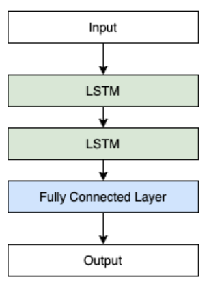
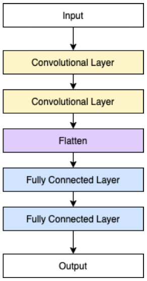
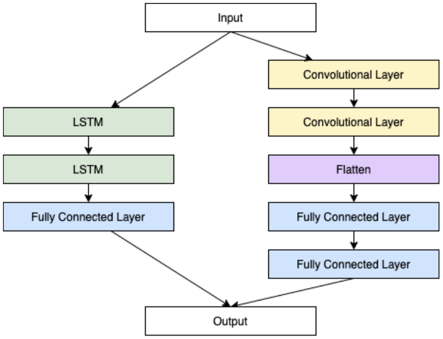
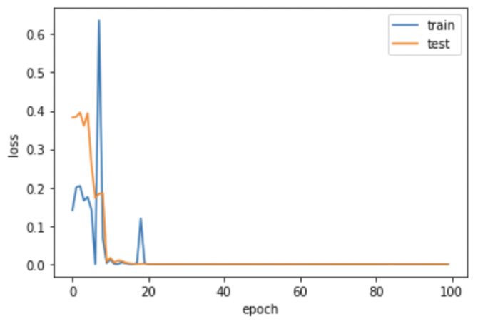
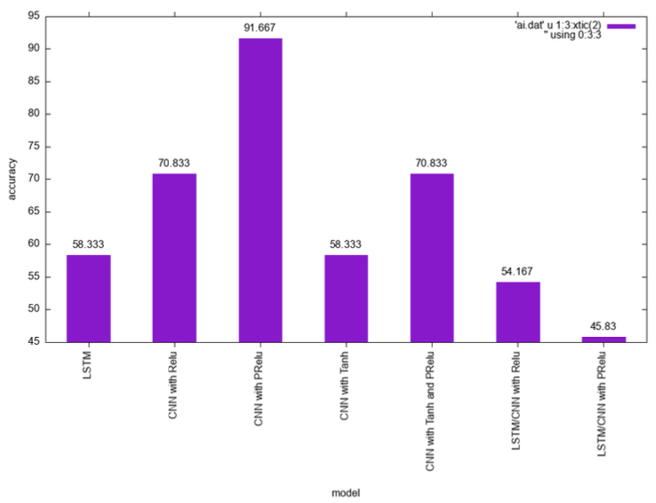

## Car Accident Detection Model based on LSTM and CNN

In this project, we tended to use Long Short-Term Memory (LSTM) network and Convolutional Neural Network (CNN) to find the probability of an incident or accident occurring between the short time period datasets. We try to build three architecture models with various activation functions and then compare each result of them giving the highest accuracy.

**It should be noted that the datasets are not provided here due to the company agreements and privacy reasons.**

### Problem Statement

Searching the entire video from dashcam and going through log data consumes a lot of manpower and material resources.  Therefore, this project find the proportion of the probability that an incident or accident moment is included in a short amount of time video and dataset. In this way, we can reduce the time consumed searching through a full-length of hundred or thousand videos per day.

### Preprocessing

The original car’s acceleration dataset of each car contains a timestamp and acceleration in x, y, and z-axis. And the labeled result dataset contains only a filename of the video and the representation of the accident. Therefore, we merge these sets of data and split them into 3 CSV files using Python with the help of Pandas library. Each file has 3 columns which are filename, the car’s acceleration, and the labeled accident according to the filename. After this preprocessing, we get 3 datasets from the original 101 datasets, named acc_x.csv, acc_y.csv, and acc_z.csv.

### Architecture Model

First, we basically analyze our dataset to see which model we should build, and since it is related to time-series, we instantly focus on the LSTM network as it might learn and classify our sequential data the best. Apart from the time-sequential, we realize that the CNN model will also be a good choice for our dataset as it focuses on the reversal of data periodically, a sudden break for example. Therefore, we also design a model based on the CNN network with different activations as they might be able to provide greater results. Based on that, we also try to combine these 2 models together to see if there is a difference in the results.

  
  
  *The model based on LSTM*

  

  *The model based on CNN*

  

  *The model based on the combination of LSTM and CNN*

### Training

We choose Cross-entropy loss function to minimize the loss and Adam optimization algorithm to optimize our models during training due to its benefits that are computationally efficient, invariant to diagonal rescale of the gradients, and little memory requirements.

### Evaluation

Train and test loss on the CNN model with PRelu activation, giving the satisfied  result among different models and activations and having the highest accuracy of 91.667% 

  

  *Tain and test loss on the CNN model with PRelu*

  

  *Accuracy comparison*

